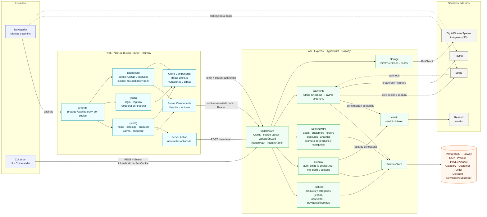

# Diagrama de arquitectura

Vista general del monorepo: quién habla con quién y por qué camino. El detalle de cada flujo está en [`architecture.md`](./architecture.md) y el modelo de datos en [`database.md`](./database.md).

**Cómo leerlo**

- Flecha continua: llamada directa. Flecha punteada: redirección del navegador o webhook.
- La sesión es un JWT que la API entrega en la cookie HttpOnly `auth-token`. El navegador la manda sola; el servidor de Next y el CLI la envían como `Authorization: Bearer`.
- Hay tres caminos de la web a la API: Client Components (mutaciones), Server Components (lecturas) y la Server Action del newsletter.
- Toda escritura en la base pasa por la API. Ni la web ni el CLI tocan Postgres directamente.
